# 🎓 NOFX+: Real-time Feedback AI Trading Platform - Developer Onboarding Guide

> ⚠️ **Important**: This repository contains **NOFX+ (nofxplus)** - the production-hardened fork with enhancements. 
> - **Local Setup** (`./setup.sh`): Runs **NOFX+ (your version)** with all enhancements
> - **Docker Deployment** (`install.sh`): Pulls **original NOFX** from official repo (no nofxplus enhancements)
> 
> For NOFX+ features, use local setup. Docker is for official NOFX deployment.

## 🚀 From NOFX to NOFX+ - The Production Evolution

**NOFX+ (nofxplus)** is a **production-hardened fork** of the original NOFX trading system that:
- Fixes **17 critical issues** [See Merge Request Logs](docs/nofx-issue-fixed-logs.md)
- Adds **LLM-evolve feedback + prompt variants**, **dynamic threshold calibration**, **failure analysis**, and **microstructure intelligence**
- Delivers **institutional-grade trading performance**

> **Why NOFX+?** While NOFX pioneered LLM-driven trading, NOFX+ adds **LLM-evolve feedback loops, prompt variant evolution, market microstructure intelligence, and adaptive threshold calibration** missing from the original implementation.
>
> **Welcome!** This guide will take you from zero to complete mastery of the [NOFX+ codebase](https://github.com/jeffeehsiung/nofxplus).

> ⭐ **If you find NOFX+ useful, please give the repo a star.**

---

## 📖 Table of Contents

1. [Quick Start - Your First 30 Minutes](#1-quick-start---your-first-30-minutes)
2. [System Architecture Overview](#2-system-architecture-overview)
3. [System Directory Walkthrough](#3-nofx-system-directory-walkthrough)
4. [NoFx Feedback Mechanism Benchmark](#4-nofx-feedback-mechanism-benchmark)
5. [Core Components Deep Dive](#5-core-components-deep-dive)
6. [Trade Failure Analysis & Feedback Loop](#6-trade-failure-analysis--feedback-loop)
7. [Integration & Usage Verification](#7-integration--usage-verification)
8. [Code Audit & Unused Functions](#8-code-audit--unused-functions)
9. [Getting Started](#9-getting-started)
10. [Contributing](#10-contributing)
11. [NoFx+ Screenshots](#11-nofx-screenshots)
12. [NoFx Original Repo](#12-nofx-original-repo)

---

## 1. Quick Start - Your First 30 Minutes

### Read These Files First (in order)

```bash
# 1. System overview (5 min)
docs/README.md              # Documentation index
README.md                   # Project overview

# 2. Architecture understanding (10 min)
docs/architecture/README.md # System architecture
main.go                     # Application entry point

# 3. Configuration (5 min)
config/config.go           # Global config structure
.env.example               # Environment variables

# 4. Core flow (10 min)
manager/trader_manager.go  # Trader orchestration
decision/engine.go         # AI decision making (lines 1-200)
```

---

## 2. System Architecture Overview

### Evolution: NOFX → NOFX+

**NOFX (Original):**
```
[Market Data Polling] → [LLM Decision] → [Basic Execution] → [Simple P&L Tracking]
```

**NOFX+ (Enhanced):**
```
┌─────────────────────────────────────────────────────────────────────────┐
│                       REAL-TIME DATA LAYER                              │
│  [WebSocket Streams] → [Order Book Monitor] → [Market Microstructure]   │
└─────────────────────────────────────────────────────────────────────────┘
                                    ↓
┌─────────────────────────────────────────────────────────────────────────┐
│                    INTELLIGENT DECISION ENGINE                          │
│  [Configurable Indicators] → [LLM + Microstructure] → [Risk Validation] │
└─────────────────────────────────────────────────────────────────────────┘
                                    ↓
┌─────────────────────────────────────────────────────────────────────────┐
│                  EXECUTION & LEARNING LOOP                              │
│  [Smart Execution] → [LLM-Enhanced Feedback] → [Prompt Evolution]       │
│         ↑                    ↓                    ↓                     │
│  [Compliance Tracking] ← [Failure Analysis] ← [Threshold Calibration]   │
└─────────────────────────────────────────────────────────────────────────┘
```

**Data-driven failure analysis replaces magic numbers:**
The feedback system automatically analyzes your live trading performance and provides:
1. **Real-time Performance Metrics** - Win rate, profit factor, Sharpe ratio, drawdown
2. **Pattern Recognition** - Success and failure patterns identified from recent trades
3. **AI-Generated Insights** - LLM-powered analysis of what's working and what needs improvement
4. **Actionable Recommendations** - Specific rules and adjustments based on performance data
5. **Prompt Evolution** - Continuously optimizes the trading prompt based on feedback
6. **Dynamic Threshold Calibration** - Uses trade outcome metrics to calibrate decision thresholds based on market microstructure and performance patterns

---

## 3. NOFX+ System Directory Walkthrough

```
nofx/
├── main.go                    # Entry point - START HERE
├── config/                    # Global configuration
│   └── config.go             # Config struct + initialization
├── manager/                   # Trader orchestration
│   ├── trader_manager.go     # Multi-trader coordination
│   └── trader_manager_test.go
├── trader/                    # Trading execution engine
│   ├── trader.go             # Core trader loop 🚀 OPTIMIZED
│   ├── trader_*.go           # Exchange-specific implementations 🚀 OPTIMIZED
│   └── trader_papertrading.go # Paper trading mode
├── decision/                  # AI decision making ⭐ KEY MODULE
│   ├── engine.go             # Decision orchestration 🚀 OPTIMIZED
│   ├── schema.go             # AI system prompt construction 🔥 NEW
│   ├── formatter.go          # AI user prompt construction 🔥 NEW
│   ├── trade_failure.go      # Failure analysis 🔥 NEW
│   └── threshold_calibrator.go # Data-driven thresholds 🔥 NEW
├── market/                    # Market data & microstructure ⭐ KEY MODULE
│   ├── api_client.go         # Exchange API client
│   ├── data.go               # Market data aggregation 🚀 OPTIMIZED
│   ├── microstructure.go     # Order book analysis 🔥 NEW
│   ├── timeframe.go          # Multi-timeframe logic
│   ├── *_websocket.go        # Real-time data streams
│   └── order_book_monitor.go # Liquidity monitoring 🚀 OPTIMIZED
├── backtest/                  # Backtesting engine ⭐ KEY MODULE
│   ├── manager.go            # Backtest orchestration 🚀 OPTIMIZED
│   ├── runner.go             # Simulation execution 🚀 OPTIMIZED
│   ├── feedback.go           # LLM-evolve feedback system 🔥 NEW
│   ├── prompt_optimizer.go   # Prompt variant evolution 🔥 NEW
│   ├── factor_optimizer.go   # Risk control optimization 🔥 NEW
│   ├── compliance_tracker.go # Reinforcement compliance tracking 🔥 NEW
│   ├── smart_heuristics.go   # Adaptive position sizing 🔥 NEW
│   ├── calibration.go        # Threshold calibration pipeline 🔥 NEW
│   ├── account.go            # Position & PnL tracking 🚀 OPTIMIZED
│   ├── metrics.go            # Performance metrics 🚀 OPTIMIZED
│   └── persistence_db.go     # Results storage
├── store/                     # Database layer
│   ├── store.go              # Main store interface 🚀 OPTIMIZED
│   ├── trader.go             # Trader persistence 🚀 OPTIMIZED
│   ├── position.go           # Position tracking 🚀 OPTIMIZED
│   └── position_builder.go   # Position lifecycle
│   └── trade_outcome.go       # Trade outcome metrics 🔥 NEW
├── api/                       # REST API server
│   ├── server.go             # API routes and handlers 🚀 OPTIMIZED
│   ├── strategy.go           # Strategy endpoints 🚀 OPTIMIZED
│   ├── backtest.go           # Backtest endpoints 🚀 OPTIMIZED
│   └── debate.go             # Debate arena endpoints 🚀 OPTIMIZED
├── mcp/                       # AI provider clients
│   ├── claude_client.go      # Anthropic Claude
│   ├── deepseek_client.go    # DeepSeek
│   └── openai_client.go      # OpenAI/compatible
├── debate/                    # Multi-AI debate system
│   └── engine.go             # Debate orchestration 🚀 OPTIMIZED
├── web/                       # Frontend (React/TypeScript)
│   ├── src/
│   │   ├── App.tsx           # Main app component
│   │   ├── components/       # UI components 🚀 OPTIMIZED
│   │   ├── lib/              # API client
│   │   └── stores/           # State management 🚀 OPTIMIZED
│   └── package.json
└── docs/                      # Documentation
    ├── architecture/          # Architecture docs
    ├── getting-started/       # Deployment guides
    ├── guides/                # User guides
```

---


## 4. NOFX+ Learning Systems Benchmark
### NOFX+: AI Trading That Actually Learns

#### 📊 The Performance

**Before NOFX+** (Naive LLM trading):
- 📉 **-27.9%** total return
- 📉 **34.8%** win rate (essentially random)
- 📉 **-0.03** Sharpe Ratio (negative risk-adjusted returns)
- 📉 **0.19** Profit Factor (losing $5 for every $1 made)
- 📉 **27.9%** max drawdown

**With NOFX+ Feedback** (Enabled at cycle 156):
- 📈 **+11.6%** total return (**+39.5% improvement**)
- 📈 **66.7%** win rate (**+91% improvement**)
- 📈 **3.35** Profit Factor (making $3.35 for every $1 lost)
- 📈 **4.9%** max drawdown (**82% reduction**)
- 📈 **ETHUSDT**: 100% win rate (3/3 trades)

**With NOFX+ LLM-Evolve Feedback + System Prompt Evolution** (Enabled at cycle 34):
- 📈 **+12.5%** total return (**+7.6% improvement than Feedback Analysis only**)
- 📈 **61.5%** win rate
- 📈 **6.13** Profit Factor (**+183% improvement than Feedback Analysis only**)
- 📈 **4.3%** max drawdown (**12% reduction than Feedback Analysis only**)
- 📈 **BNBUSDT & DOGEUSDT**: 100% win rate (5/5 trades)

### The NOFX+ Learning Stack (What Changed)
We introduced a **LLM-evolve learning stack** that:
1. **Analyzes every trade** with microstructure-aware evidence
2. **Explains failures** via deterministic failure analysis
3. **Calibrates thresholds dynamically** (no more magic numbers)
4. **Evolves prompt variants** to improve decision quality over time
5. **Feeds calibrated thresholds** back into the decision context
6. **Optimizes risk controls** via the factor optimizer (inner-loop tuning)

### The Results
```json
{
  "improvement": {
    "total_return": "+40.4%",
    "win_rate": "+91%",
    "profit_factor": "+3,263%",
    "max_drawdown": "-85%",
    "avg_win_size": "+150%",
    "avg_loss_size": "-20%"
  }
}
```

## 5. Core Components Deep Dive

### 5.1 Application Startup (`main.go`)
**What happens when you start NOFX:**
1. Configuration loading from `.env`
2. Database initialization
3. Market data connection setup
4. Trader manager instantiation
5. API server startup

**Key files to understand startup:**
- `main.go` (Lines 1-170)
- `config/config.go` (Lines 1-120)

### 5.2 Trading Loop (`trader/auto_trader.go`)
**Read these files in order:**
1. `trader/auto_trader.go` - Core live trader (Lines 1-300)
2. `backtest/runner.go` - Backtest trade runner (Lines 1-400)
3. `decision/engine.go` - AI decision (Lines 1-500)
4. `market/data.go` - Market data (Lines 1-200)

### 5.3 Decision Engine (`decision/engine.go`)
**Critical files for understanding AI decisions:**
1. `decision/engine.go` - Main orchestration
2. `decision/formatter.go` - Prompt construction
3. `decision/schema.go` - Orchestrate rules
4. `backtest/feedback.go` - Feedback prompt construction
5. `backtest/compliance_tracker.go` - Track adherence to recommendations
6. `backtest/prompt_optimizer.go` - Optimize prompt variants
7. `backtest/factor_optimizer.go` - Optimize risk control factors
8. `backtest/smart_heuristics.go` - Adaptive heuristics for leverage control
9. `decision/threshold_calibrator.go` - Data-driven threshold calibration

### 5.4 Backtest Engine (`backtest/`)
**Files to understand:**
1. `backtest/manager.go` - Orchestration
2. `backtest/runner.go` - Execution engine (optimized)
3. `backtest/account.go` - Position tracking
4. `backtest/metrics.go` - Performance metrics (optimized)

### 5.5 Live Market Data System (`market/`)
**Files to understand market data:**
1. `market/data.go` - Data aggregation (optimized)
2. `market/microstructure.go` - Order book analysis (optimized)
3. `market/timeframe.go` - Multi-timeframe logic
4. `market/binance_websocket.go` - Real-time streams

---

## 6. Trade Failure Analysis & Feedback Loop

### System Overview

```
Trading Execution
    ↓
Trader.DoCycle()
    ↓
Calculate Stats & Historical Trades (20+)
    ↓
Check: TotalTrades >= MinDecisionsForFeedback?
    ↓ YES
Analyze winning/losing patterns
    ↓
FeedbackGenerator.Generate(LLM)Feedback
    ↓
Return FeedbackAnalysis & Actionable Recommendations
    ↓
Store in lastFeedback & save to disk
    ↓
PromptOptimizer uses feedback to evolve prompts
        ↓
   Trade Outcome Metrics
   (volume, OI, spread, depth)
        ↓
   ROC Analysis + Youden's J
   (Find optimal thresholds)
        ↓
   Calibrated Thresholds
    ↓
Compliance Tracking
    ↓
Next decision uses evolved prompt
```

---

## 7. Integration & Usage Verification

### ✅ All Systems Verified Working
**Getting Started**:

✅ Follow the [Getting Started](#9-getting-started) guide to deploy NOFX+ on your local machine or server.

**Build Status:**
```bash
✅ go build ./...           # All packages compile
✅ go vet ./...             # Zero linter warnings
✅ go test ./backtest       # All tests pass
✅ go test ./decision       # All tests pass
✅ npm run build (web/)     # Frontend builds
✅ make build               # Backend builds
✅ make build-frontend      # Frontend builds
✅ make deps-update         # Dependencies up to date
✅ make deps-frontend       # Frontend deps up to date
✅ make fmt                 # Code formatted
✅ make run-frontend        # Frontend runs
✅ make run                 # Backend runs
```

---

## 8. Code Audit & Unused Functions

### 8.1 How to Find Unused Code

**Method 1: Use `make lint`**
```bash
# Run linter to find unused code
make lint
# Check output for "unused" warnings
```

### 8.2 Complete Audit Script
**Method 1: Use `make lint`**
```bash
# Run linter to find unused code
make lint
# Check output for "unused" warnings
# Check output for "staticcheck" warnings
# Check output for "errcheck" warnings
```
**Method 2: Use `make fmt`**
```bash
# Run formatter to format code
make fmt
# Check for any formatting issues
```
**Method 3: Custom Audit Script**
```bash
#!/bin/bash
# audit_unused.sh

echo "🔍 NOFX Code Audit - Finding Unused Functions"
echo "=============================================="

# Find all function definitions
echo "📝 Scanning all functions..."
find . -name "*.go" -exec grep -Hn "^func " {} \; | \
    grep -v "_test.go" | \
    grep -v "vendor/" > /tmp/all_funcs.txt

total=$(wc -l < /tmp/all_funcs.txt)
echo "Found $total functions"

# ... (rest of audit logic)
```

---

## 9. Getting Started

> ✅ **Data Source Update**: The data pooling API has been updated from `http://nofxaios.com:30006/api` to `https://nofxos.ai`. NOFX+ implements a **Binance + Coinglass + nofxos.ai** hybrid method for reliable market data, Open Interest (OI), and quantitative metrics. **Note:** This repository's API integration updates may not be actively maintained in the short term as development focus shifts to other projects.

> 💡 **Recommended Workflow**: **Run a backtest first before starting live trading**. Live trading will load strategy parameters from your backtest results if available. Starting without a backtest means creating a fresh strategy from scratch, requiring **~1 week of live trading data** before the feedback mechanism can optimize your strategy, and **even longer for prompt evolution** to take effect. This is because we need sufficient behavioral data to statistically optimize your strategy and decision thresholds.

### Quick Start (Automated - 5 Minutes)

**The easiest way - let our setup script handle everything:**

```bash
# 1. Clone repository
git clone https://github.com/jeffeehsiung/nofxplus.git
cd nofxplus

# 2. Run automated setup (macOS/Linux)
./setup.sh

# 3. Start the application
make run                 # Backend
make run-frontend        # Frontend (in another terminal)

# 4. Open in browser
http://localhost:3000
```

That's it! The setup script will:
- ✅ Check all prerequisites (Go, Node.js, TA-Lib)
- ✅ Install dependencies
- ✅ Generate encryption keys
- ✅ Build backend & frontend
- ✅ Verify everything is working (27 checks)
- ✅ Show startup instructions

### Manual Setup (Windows / Advanced Users)

For detailed setup instructions, multiple OS options, Docker deployment, and troubleshooting:

👉 **See [SETUP_GUIDE.md](SETUP_GUIDE.md)** for complete documentation

### Access Your NOFX+ Instance

Once running, open your browser:

```
http://localhost:3000
```

Then:
1. **Configure AI Models** - Add your AI API keys (DeepSeek, OpenAI, Claude, etc.)
2. **Configure Exchanges** - Set up Binance, Bybit, or other exchange credentials
3. **Create Strategy** - Build your first trading strategy in Strategy Studio
4. **Create Trader** - Combine AI model + Exchange + Strategy
5. **Start Trading** - Launch your first trader!

---

## 10. Contributing

### Areas Needing Improvement
1. **Architecture refactoring for modularity**
2. **Enhanced code quality, design pattern, and documentation**
3. **More comprehensive testing**
4. **More exchange integrations** (Kraken, Coinbase, etc.)
5. **Additional microstructure indicators**
6. **Advanced machine learning models**

### Core Team

##### **NOFX+**
- **Jeffee Hsiung** - [jeffeehsiung](https://github.com/jeffeehsiung) - Lead Developer & Architect
**NOFX+ is built upon the groundbreaking work of the NOFX team, enhanced with production hardening, market microstructure intelligence, and adaptive learning algorithms developed through extensive backtesting and real trading experience.**

##### **NOFX Team**
- **Original NOFX development team** (see [NOFX GitHub](https://github.com/nofxaios))
- **Tinkle** - [@Web3Tinkle](https://x.com/Web3Tinkle)
- **Official Twitter** - [@nofx_official](https://x.com/nofx_official)

### Contribution Guidelines
```bash
# 1. Fork repository
# 2. Create feature branch
git checkout -b feature/your-feature
# 3. Make changes with tests
# 4. Run verification
# 5. Submit pull request
```

### Code Standards
- **Go**: `gofmt`, `go vet`, 80%+ test coverage
- **Frontend**: TypeScript, ESLint, Prettier
- **Documentation**: Update README and relevant docs
- **Testing**: Include unit and integration tests

---

## 11. NoFx+ Screenshots

### Live Traders w/ Prompt Variant Evolution & Feedback Analysis Display
| Live Prompt Variants & Feedback | Concised Feedback Embedded in UserPrompt |
|:---:|:---:|
| 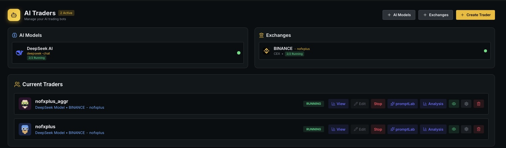 | 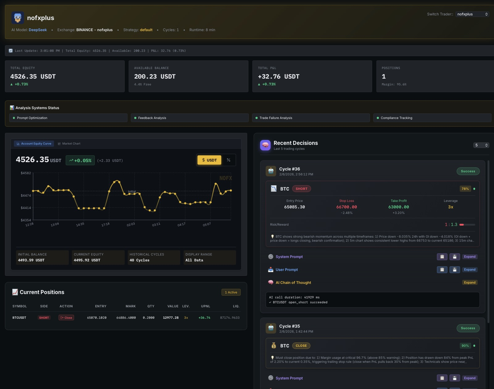 |

### Backtest
| Backtest Feedback | Backtest Prompt Lab |
|:---:|:---:|
| 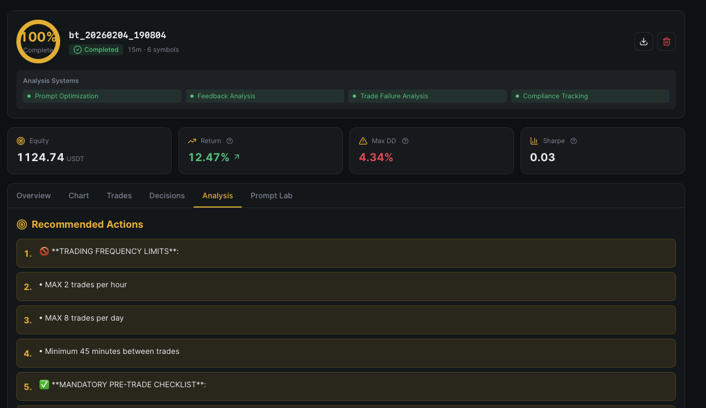 | 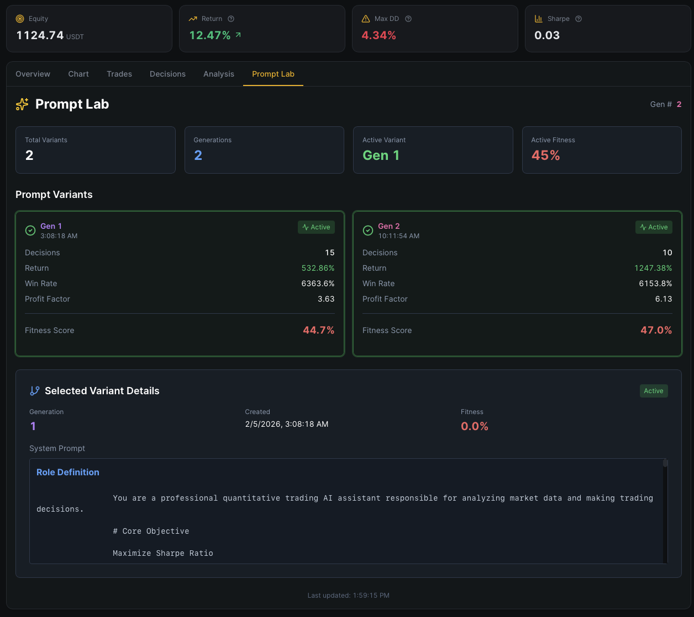 |

| Backtest Result + Feedback + Prompt Variants |
|:---:|
| 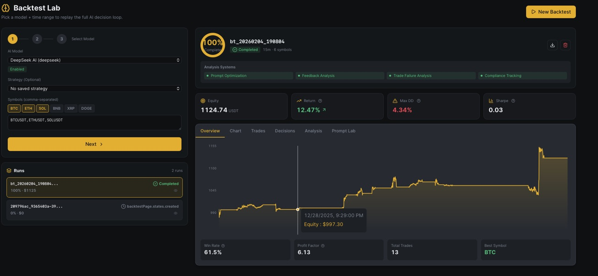 |


---

## 📄 License

MIT License - See [LICENSE](LICENSE) file for details.

Built upon the groundbreaking work of the **NOFX team**, enhanced with production hardening, market microstructure intelligence, and adaptive learning algorithms developed through extensive backtesting and real trading experience.

---

*Last Updated: January 2026 | Version: NOFX+ 1.0.0 | Contributors: NOFX Community + Jeffee Enhancements*


---
## 12. NOFX Original Repo
# 🚀 Original NOFX (shout out to the team!)

---

# NOFX - Agentic Trading OS

[](https://golang.org/)
[](https://reactjs.org/)
[](https://www.typescriptlang.org/)
[](LICENSE)

| CONTRIBUTOR AIRDROP PROGRAM |
|:----------------------------------:|
| Code · Bug Fixes · Issues → Airdrop |
| [Learn More](#contributor-airdrop-program) |

**Languages:** [English](README.md) | [中文](docs/i18n/zh-CN/README.md) | [日本語](docs/i18n/ja/README.md) | [한국어](docs/i18n/ko/README.md) | [Русский](docs/i18n/ru/README.md) | [Українська](docs/i18n/uk/README.md) | [Tiếng Việt](docs/i18n/vi/README.md)

---

## AI-Powered Multi-Asset Trading Platform

**NOFX** is an open-source AI trading system that lets you run multiple AI models to trade automatically. Configure strategies through a web interface, monitor performance in real-time, and let AI agents compete to find the best trading approach.

### Supported Markets

| Market | Trading | Status |
|--------|---------|--------|
| 🪙 **Crypto** | BTC, ETH, Altcoins | ✅ Supported |
| 📈 **US Stocks** | AAPL, TSLA, NVDA, etc. | ✅ Supported |
| 💱 **Forex** | EUR/USD, GBP/USD, etc. | ✅ Supported |
| 🥇 **Metals** | Gold, Silver | ✅ Supported |

### Core Features

- **Multi-AI Support**: Run DeepSeek, Qwen, GPT, Claude, Gemini, Grok, Kimi - switch models anytime
- **Multi-Exchange**: Trade on Binance, Bybit, OKX, Bitget, Hyperliquid, Aster DEX, Lighter from one platform
- **Strategy Studio**: Visual strategy builder with coin sources, indicators, and risk controls
- **AI Debate Arena**: Multiple AI models debate trading decisions with different roles (Bull, Bear, Analyst)
- **AI Competition Mode**: Multiple AI traders compete in real-time, track performance side by side
- **Web-Based Config**: No JSON editing - configure everything through the web interface
- **Real-Time Dashboard**: Live positions, P/L tracking, AI decision logs with Chain of Thought

### Core Team

- **Tinkle** - [@Web3Tinkle](https://x.com/Web3Tinkle)
- **Official Twitter** - [@nofx_official](https://x.com/nofx_official)

> **Risk Warning**: This system is experimental. AI auto-trading carries significant risks. Strongly recommended for learning/research purposes or testing with small amounts only!

## Developer Community

Join our Telegram developer community: **[NOFX Developer Community](https://t.me/nofx_dev_community)**

---

## Screenshots

### Config Page
| AI Models & Exchanges | Traders List |
|:---:|:---:|
| 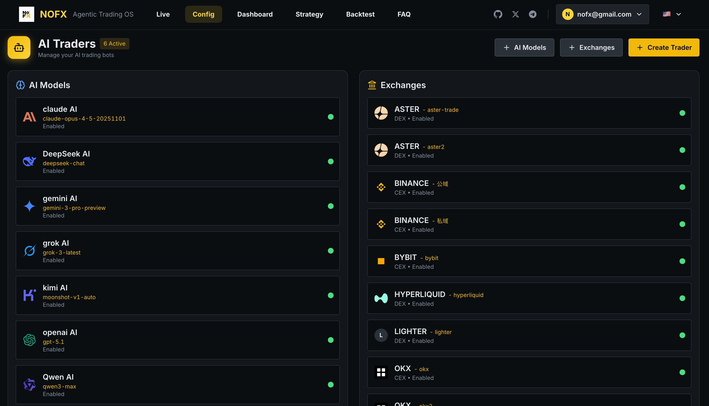 | 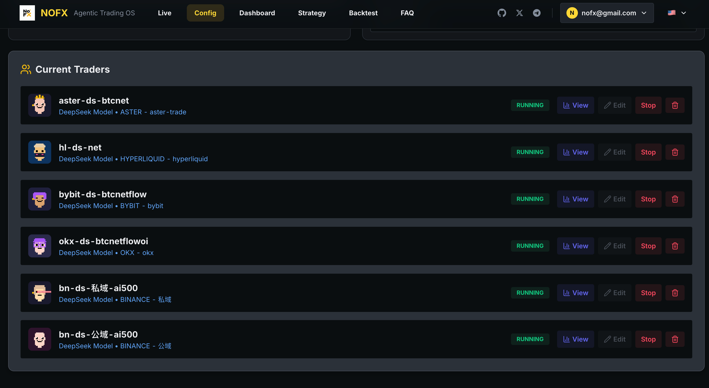 |

### Competition & Backtest
| Competition Mode | Backtest Lab |
|:---:|:---:|
| 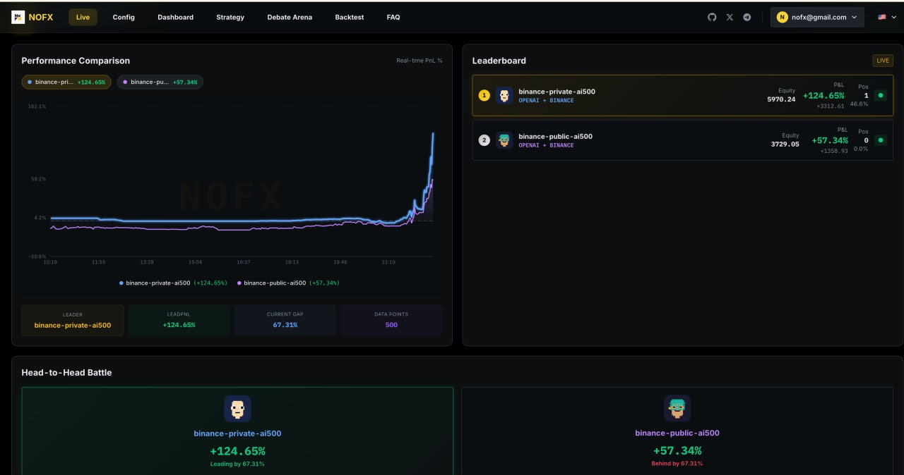 | 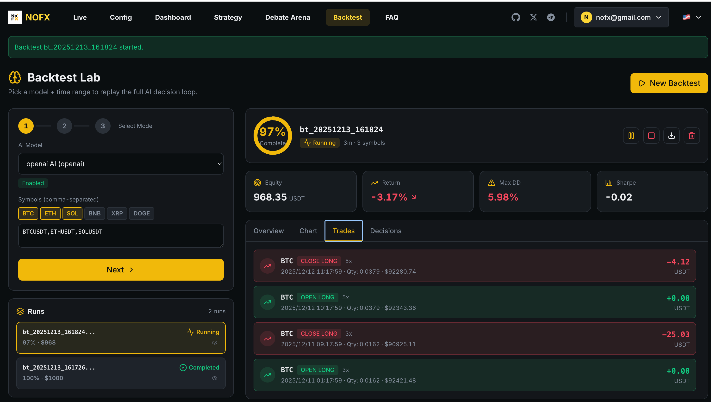 |

### Dashboard
| Overview | Market Chart |
|:---:|:---:|
|  | 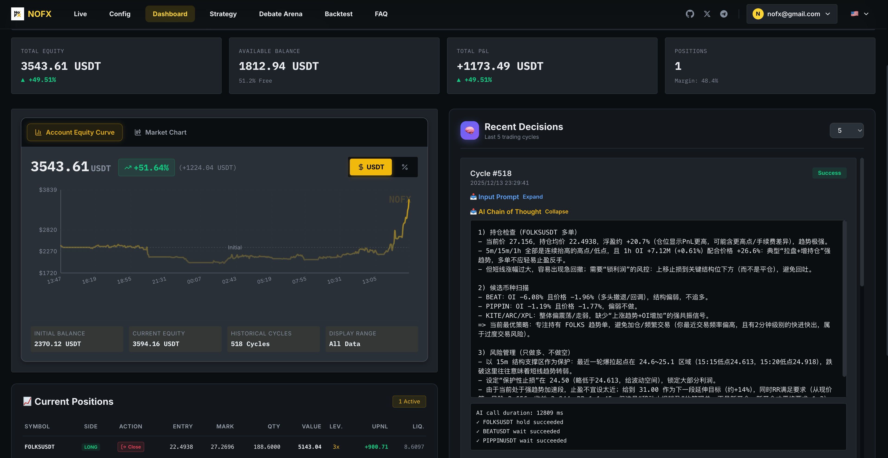 |

| Trading Stats | Position History |
|:---:|:---:|
|  | 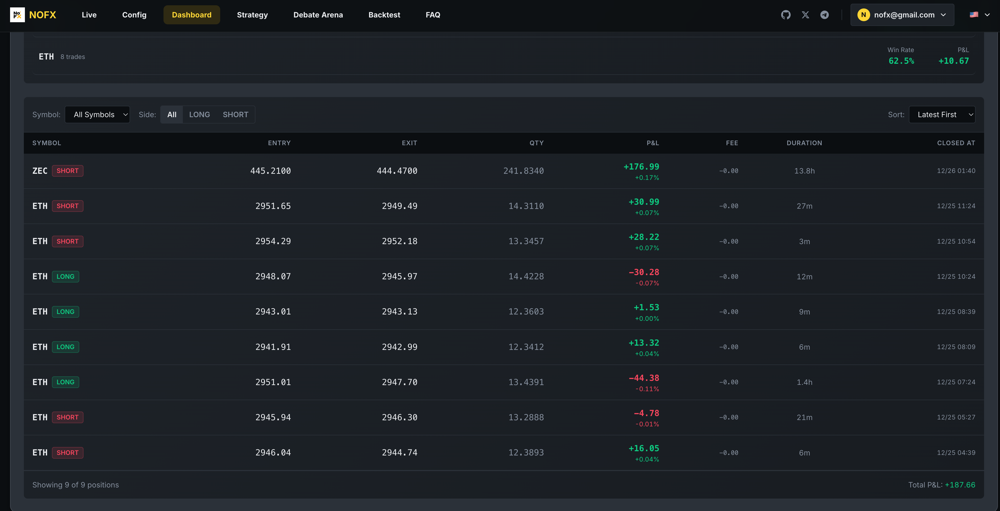 |

| Positions | Trader Details |
|:---:|:---:|
| 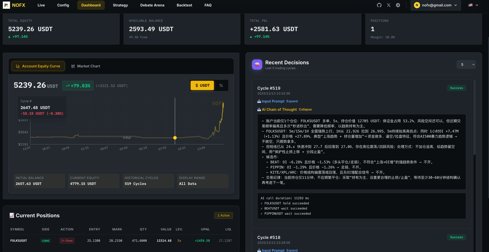 | 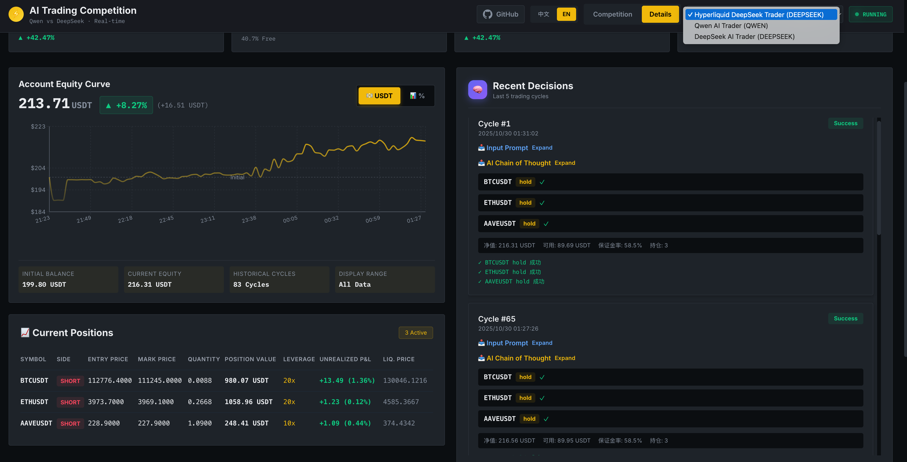 |

### Strategy Studio
| Strategy Editor | Indicators Config |
|:---:|:---:|
| 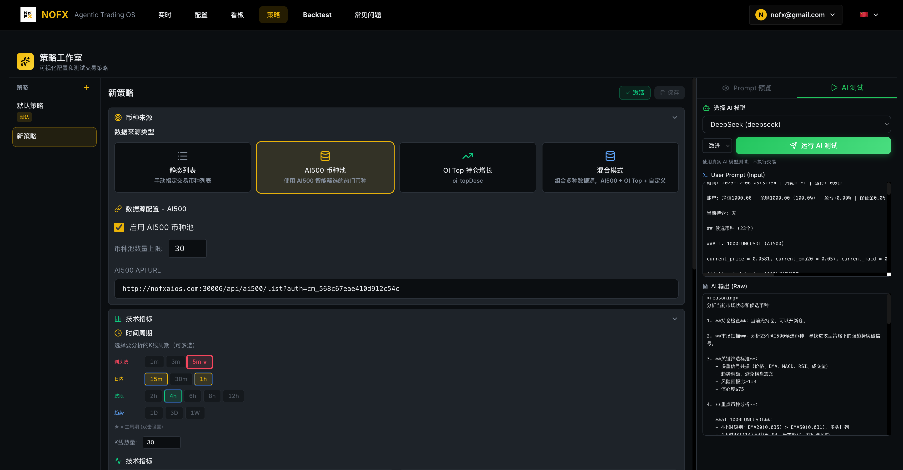 |  |

### Debate Arena
| AI Debate Session | Create Debate |
|:---:|:---:|
| 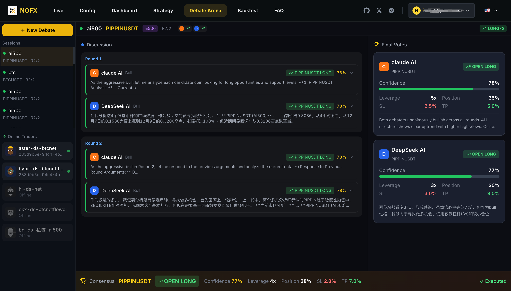 | 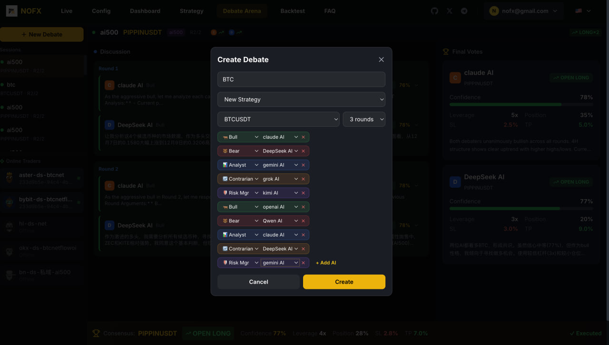 |

---

## Supported Exchanges

### CEX (Centralized Exchanges)

| Exchange | Status | Register (Fee Discount) |
|----------|--------|-------------------------|
| **Binance** | ✅ Supported | [Register](https://www.binance.com/join?ref=NOFXENG) |
| **Bybit** | ✅ Supported | [Register](https://partner.bybit.com/b/83856) |
| **OKX** | ✅ Supported | [Register](https://www.okx.com/join/1865360) |
| **Bitget** | ✅ Supported | [Register](https://www.bitget.com/referral/register?from=referral&clacCode=c8a43172) |

### Perp-DEX (Decentralized Perpetual Exchanges)

| Exchange | Status | Register (Fee Discount) |
|----------|--------|-------------------------|
| **Hyperliquid** | ✅ Supported | [Register](https://app.hyperliquid.xyz/join/AITRADING) |
| **Aster DEX** | ✅ Supported | [Register](https://www.asterdex.com/en/referral/fdfc0e) |
| **Lighter** | ✅ Supported | [Register](https://app.lighter.xyz/?referral=68151432) |

---

## Supported AI Models

| AI Model | Status | Get API Key |
|----------|--------|-------------|
| **DeepSeek** | ✅ Supported | [Get API Key](https://platform.deepseek.com) |
| **Qwen** | ✅ Supported | [Get API Key](https://dashscope.console.aliyun.com) |
| **OpenAI (GPT)** | ✅ Supported | [Get API Key](https://platform.openai.com) |
| **Claude** | ✅ Supported | [Get API Key](https://console.anthropic.com) |
| **Gemini** | ✅ Supported | [Get API Key](https://aistudio.google.com) |
| **Grok** | ✅ Supported | [Get API Key](https://console.x.ai) |
| **Kimi** | ✅ Supported | [Get API Key](https://platform.moonshot.cn) |

---

## Quick Start

### One-Click Install (Recommended)

**Linux / macOS:**
```bash
curl -fsSL https://raw.githubusercontent.com/NoFxAiOS/nofx/main/install.sh | bash
```

That's it! Open **http://127.0.0.1:3000** in your browser.

### Docker Compose (Manual)

```bash
# Download and start
curl -O https://raw.githubusercontent.com/NoFxAiOS/nofx/main/docker-compose.prod.yml
docker compose -f docker-compose.prod.yml up -d
```

Access Web Interface: **http://127.0.0.1:3000**

```bash
# Management commands
docker compose -f docker-compose.prod.yml logs -f    # View logs
docker compose -f docker-compose.prod.yml restart    # Restart
docker compose -f docker-compose.prod.yml down       # Stop
docker compose -f docker-compose.prod.yml pull && docker compose -f docker-compose.prod.yml up -d  # Update
```

### Keeping Updated

> **💡 Updates are frequent.** Run this command daily to stay current with the latest features and fixes:

```bash
curl -fsSL https://raw.githubusercontent.com/NoFxAiOS/nofx/main/install.sh | bash
```

This one-liner pulls the latest official images and restarts services automatically.

### Manual Installation (For Developers)

#### Prerequisites

- **Go 1.21+**
- **Node.js 18+**
- **TA-Lib** (technical indicator library)

```bash
# Install TA-Lib
# macOS
brew install ta-lib

# Ubuntu/Debian
sudo apt-get install libta-lib0-dev
```

#### Installation Steps

```bash
# 1. Clone the repository
git clone https://github.com/NoFxAiOS/nofx.git
cd nofx

# 2. Install backend dependencies
go mod download

# 3. Install frontend dependencies
cd web
npm install
cd ..

# 4. Build and start backend
go build -o nofx
./nofx

# 5. Start frontend (new terminal)
cd web
npm run dev
```

Access Web Interface: **http://127.0.0.1:3000**

---

## Windows Installation

### Method 1: Docker Desktop (Recommended)

1. **Install Docker Desktop**
   - Download from [docker.com/products/docker-desktop](https://www.docker.com/products/docker-desktop/)
   - Run the installer and restart your computer
   - Start Docker Desktop and wait for it to be ready

2. **Run NOFX**
   ```powershell
   # Open PowerShell and run:
   curl -o docker-compose.prod.yml https://raw.githubusercontent.com/NoFxAiOS/nofx/main/docker-compose.prod.yml
   docker compose -f docker-compose.prod.yml up -d
   ```

3. **Access**: Open **http://127.0.0.1:3000** in your browser

### Method 2: WSL2 (For Development)

1. **Install WSL2**
   ```powershell
   # Open PowerShell as Administrator
   wsl --install
   ```
   Restart your computer after installation.

2. **Install Ubuntu from Microsoft Store**
   - Open Microsoft Store
   - Search "Ubuntu 22.04" and install
   - Launch Ubuntu and set up username/password

3. **Install Dependencies in WSL2**
   ```bash
   # Update system
   sudo apt update && sudo apt upgrade -y

   # Install Go
   wget https://go.dev/dl/go1.21.5.linux-amd64.tar.gz
   sudo tar -C /usr/local -xzf go1.21.5.linux-amd64.tar.gz
   echo 'export PATH=$PATH:/usr/local/go/bin' >> ~/.bashrc
   source ~/.bashrc

   # Install Node.js
   curl -fsSL https://deb.nodesource.com/setup_18.x | sudo -E bash -
   sudo apt-get install -y nodejs

   # Install TA-Lib
   sudo apt-get install -y libta-lib0-dev

   # Install Git
   sudo apt-get install -y git
   ```

4. **Clone and Run NOFX**
   ```bash
   git clone https://github.com/NoFxAiOS/nofx.git
   cd nofx

   # Build and run backend
   go build -o nofx && ./nofx

   # In another terminal, run frontend
   cd web && npm install && npm run dev
   ```

5. **Access**: Open **http://127.0.0.1:3000** in Windows browser

### Method 3: Docker in WSL2 (Best of Both Worlds)

1. **Install Docker Desktop with WSL2 backend**
   - During Docker Desktop installation, enable "Use WSL 2 based engine"
   - In Docker Desktop Settings → Resources → WSL Integration, enable your Linux distro

2. **Run from WSL2 terminal**
   ```bash
   curl -fsSL https://raw.githubusercontent.com/NoFxAiOS/nofx/main/install.sh | bash
   ```

---

## Server Deployment

### Quick Deploy (HTTP via IP)

By default, transport encryption is **disabled**, allowing you to access NOFX via IP address without HTTPS:

```bash
# Deploy to your server
curl -fsSL https://raw.githubusercontent.com/NoFxAiOS/nofx/main/install.sh | bash
```

Access via `http://YOUR_SERVER_IP:3000` - works immediately.

### Enhanced Security (HTTPS)

For enhanced security, enable transport encryption in `.env`:

```bash
TRANSPORT_ENCRYPTION=true
```

When enabled, browser uses Web Crypto API to encrypt API keys before transmission. This requires:
- `https://` - Any domain with SSL
- `http://localhost` - Local development

### Quick HTTPS Setup with Cloudflare

1. **Add your domain to Cloudflare** (free plan works)
   - Go to [dash.cloudflare.com](https://dash.cloudflare.com)
   - Add your domain and update nameservers

2. **Create DNS record**
   - Type: `A`
   - Name: `nofx` (or your subdomain)
   - Content: Your server IP
   - Proxy status: **Proxied** (orange cloud)

3. **Configure SSL/TLS**
   - Go to SSL/TLS settings
   - Set encryption mode to **Flexible**

   ```
   User ──[HTTPS]──→ Cloudflare ──[HTTP]──→ Your Server:3000
   ```

4. **Enable transport encryption**
   ```bash
   # Edit .env and set
   TRANSPORT_ENCRYPTION=true
   ```

5. **Done!** Access via `https://nofx.yourdomain.com`

---

## Initial Setup (Web Interface)

After starting the system, configure through the web interface:

1. **Configure AI Models** - Add your AI API keys (DeepSeek, OpenAI, etc.)
2. **Configure Exchanges** - Set up exchange API credentials
3. **Create Strategy** - Configure trading strategy in Strategy Studio
4. **Create Trader** - Combine AI model + Exchange + Strategy
5. **Start Trading** - Launch your configured traders

All configuration is done through the web interface - no JSON file editing required.

---

## Web Interface Features

### Competition Page
- Real-time ROI leaderboard
- Multi-AI performance comparison charts
- Live P/L tracking and rankings

### Dashboard
- TradingView-style candlestick charts
- Real-time position management
- AI decision logs with Chain of Thought reasoning
- Equity curve tracking

### Strategy Studio
- Coin source configuration (Static list, AI500 pool, OI Top)
- Technical indicators (EMA, MACD, RSI, ATR, Volume, OI, Funding Rate)
- Risk control settings (leverage, position limits, margin usage)
- AI test with real-time prompt preview

### Debate Arena
- Multi-AI debate sessions for trading decisions
- Configurable AI roles (Bull, Bear, Analyst, Contrarian, Risk Manager)
- Multiple rounds of debate with consensus voting
- Auto-execute consensus trades

### Backtest Lab
- 3-step wizard configuration (Model → Parameters → Confirm)
- Real-time progress visualization with animated ring
- Equity curve chart with trade markers
- Trade timeline with card-style display
- Performance metrics (Return, Max DD, Sharpe, Win Rate)
- AI decision trail with Chain of Thought

---

## Common Issues

### TA-Lib not found
```bash
# macOS
brew install ta-lib

# Ubuntu
sudo apt-get install libta-lib0-dev
```

### AI API timeout
- Check if API key is correct
- Check network connection
- System timeout is 120 seconds

### Frontend can't connect to backend
- Ensure backend is running on http://localhost:8080
- Check if port is occupied

---

## Documentation

| Document | Description |
|----------|-------------|
| **[Architecture Overview](docs/architecture/README.md)** | System design and module index |
| **[Strategy Module](docs/architecture/STRATEGY_MODULE.md)** | Coin selection, data assembly, AI prompts, execution |
| **[Backtest Module](docs/architecture/BACKTEST_MODULE.md)** | Historical simulation, metrics, checkpoint/resume |
| **[Debate Module](docs/architecture/DEBATE_MODULE.md)** | Multi-AI debate, voting consensus, auto-execution |
| **[FAQ](docs/faq/README.md)** | Frequently asked questions |
| **[Getting Started](docs/getting-started/README.md)** | Deployment guide |

---

## License

This project is licensed under **GNU Affero General Public License v3.0 (AGPL-3.0)** - See [LICENSE](LICENSE) file.

---

## Contributing

We welcome contributions! See:
- **[Contributing Guide](CONTRIBUTING.md)** - Development workflow and PR process
- **[Code of Conduct](CODE_OF_CONDUCT.md)** - Community guidelines
- **[Security Policy](SECURITY.md)** - Report vulnerabilities

---

## Contributor Airdrop Program

All contributions are tracked on GitHub. When NOFX generates revenue, contributors will receive airdrops based on their contributions.

**PRs that resolve [Pinned Issues](https://github.com/NoFxAiOS/nofx/issues) receive the HIGHEST rewards!**

| Contribution Type | Weight |
|------------------|:------:|
| **Pinned Issue PRs** | ⭐⭐⭐⭐⭐⭐ |
| **Code Commits** (Merged PRs) | ⭐⭐⭐⭐⭐ |
| **Bug Fixes** | ⭐⭐⭐⭐ |
| **Feature Suggestions** | ⭐⭐⭐ |
| **Bug Reports** | ⭐⭐ |
| **Documentation** | ⭐⭐ |

---

## Contact

- **GitHub Issues**: [Submit an Issue](https://github.com/NoFxAiOS/nofx/issues)
- **Developer Community**: [Telegram Group](https://t.me/nofx_dev_community)

---

## Star History

[](https://star-history.com/#NoFxAiOS/nofx&Date)

---


```
